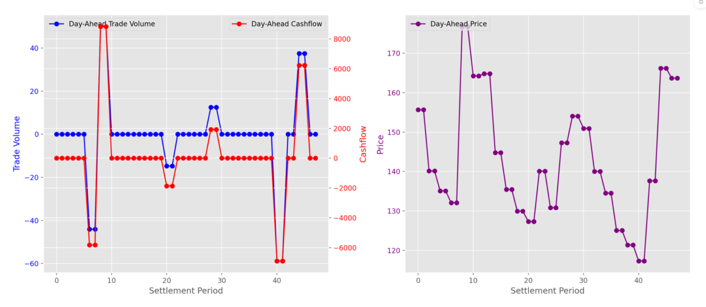
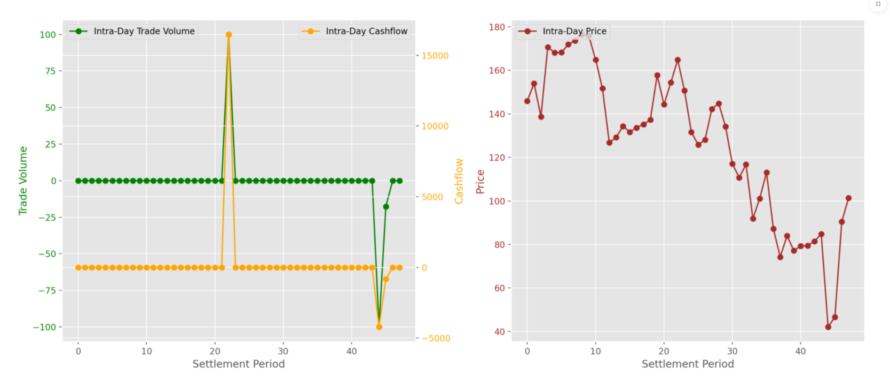

# Q&A Documentation

## Methodology
### Objective
The goal of this study is to optimize battery trading operations in the day-ahead electricity market while incorporating intra-day adjustments. This enables better revenue management for battery storage operators, ensuring that both market strategies contribute to profitability.

### Approach
- **Data Preprocessing:** We use historical electricity price data for both the day-ahead and intra-day markets.
- **Optimization Strategy:**
  - **Day-Ahead Trading:** A perfect foresight optimization model determines optimal trading volumes.
  - **Intra-Day Trading:** Adjustments are made based on real-time intra-day prices, while ensuring the integrity of the battery's state of charge (SOC).
- **Model Implementation:** The optimization is implemented using Pyomo for constraint modeling and Streamlit for visualization.
- **Validation:** The model is validated by running multiple simulations with different battery configurations and market conditions.

## Findings

### Day-Ahead Trading (Day 38)



The figure provided illustrates key insights from the day-ahead optimization process:

- **Day-Ahead Trade Volume vs. Cashflow:**
  - Trade volumes (blue) fluctuate throughout the settlement periods, aligning with periods of high price volatility.
  - The cashflow (red) follows a similar pattern, with significant peaks and drops indicating profitable trading opportunities.
  
- **Day-Ahead Price Trends:**
  - Prices exhibit cyclical behavior with noticeable peaks.
  - High prices correlate with increased trading activity, as expected in an arbitrage-based optimization model.
  
- **Key Takeaways:**
  - The model successfully identifies periods where trading is most beneficial.
  - The synchronization of trade volume and price peaks indicates effective forecasting.
  - The final state of charge is preserved, ensuring operational feasibility for subsequent trading days.

### Intra-Day Trading (Day 21)


The figure provided illustrates key insights from the intra-day optimization process:

- **Intra-Day Trade Volume vs. Cashflow:**
  - Intra-day trading (green) occurs primarily in response to price deviations from the day-ahead forecast.
  - The cashflow (orange) shows strong peaks corresponding to high-profit intra-day trades.
  
- **Intra-Day Price Trends:**
  - Prices exhibit greater volatility compared to the day-ahead market.
  - The strategy effectively takes advantage of price discrepancies to optimize battery operations.
  
- **Key Takeaways:**
  - The intra-day market provides additional revenue potential by adjusting trades dynamically.
  - The model ensures that intra-day trading complements day-ahead positions rather than conflicting with them.
  - High-frequency trading opportunities in volatile periods are successfully captured, leading to higher profitability.


These results confirm that the optimized battery trading strategy improves revenue generation while adhering to physical and market constraints.


## Questions 1

## Question 2
## 2.1. Cloud Deployment Strategy

Given the requirements, the following cloud-based architecture is proposed for deploying the containerized Streamlit application:

### 2.1.1 Data Ingestion (Email Processing)
- **AWS Simple Email Service (SES):** Configure an email receiving rule that stores incoming emails with price data in **Amazon S3**.
- **AWS Lambda Function:** A Lambda function triggers upon email arrival, extracting the price data and storing it in **S3**.

### 2.1.2 Application Hosting & Access Control
- **AWS Fargate (ECS) or AWS Lambda (Container-based Deployment):**
  - The containerized Streamlit application is deployed using AWS Fargate or AWS Lambda for serverless execution.
- **Amazon Cognito / Streamlit Login Authentication:** Implements user authentication and access control, ensuring only a subset of company users can access and run the model.

### 2.1.3 Database for Historical Runs
- **Amazon RDS (PostgreSQL or MySQL):** Stores results from past runs, enabling users to query and view previous results instead of re-running simulations.

### 2.1.4 CI/CD & Monitoring
- **GitHub Actions:** Automates testing and deployment to AWS.
- **AWS CloudWatch:** Monitors application performance and logs system behavior for debugging.

### Summary of Cloud Components

| Component           | Cloud Service          |
| ------------------- | ---------------------- |
| Email Processing    | AWS SES & Lambda       |
| Storage for Prices  | Amazon S3 & RDS        |
| Application Hosting | AWS Fargate / Lambda   |
| Authentication      | Amazon Cognito         |
| Database            | Amazon RDS             |
| Monitoring          | AWS CloudWatch         |

This approach ensures that the system is scalable, secure, and automated while leveraging AWS cloud services for reliability.


## Question 3
## 3.1 Critical Factors in Continuous Deployment
Ensuring consistent uptime for the deployed Streamlit application requires careful consideration of the following factors:

### 3.1.1 Deployment Strategy
- **Blue-Green Deployment:** Reduces downtime by running two separate environments, allowing seamless rollbacks if necessary.
- **Canary Releases:** Gradually roll out new updates to a subset of users before full deployment.

### 3.1.2 Monitoring & Alerting
- **AWS CloudWatch :** Monitors resource utilization, request latency, and error rates.

### 3.1.3 Security & Compliance
- **Role-Based Access Control (RBAC):** Ensures only authorized users can deploy and access the system.
- **Encryption (AWS KMS / TLS):** Encrypts sensitive data both at rest and in transit.
- **IAM Policies & Least Privilege Access:** Restricts permissions to only what is necessary.

### 3.1.4 Database Management
- **Automated Backups (AWS RDS Snapshots):** Ensures data recovery in case of failures.
- **Database Read Replicas:** Improves query performance by offloading reads from the main database.

### 3.1.5 CI/CD Reliability
- **Automated Testing (Unit, Integration, Performance Tests):** Prevents deployment of faulty code.
- **GitHub Actions:** Ensures consistent, automated deployments.

By incorporating these best practices, the continuous deployment pipeline ensures high availability, security, and reliability while minimizing downtime for end users.

## Question 4

## 4.1 Database Selection & Query Example

### Recommended Database
- **Amazon RDS (PostgreSQL)**: Provides ACID compliance, scalability, and robust security for sensitive operational data.

### SQL Query to Join Operational Data with Model Outputs
```sql
SELECT m.timestamp, m.trade_volume, m.cashflow, o.actual_trade_volume, o.actual_cashflow 
FROM model_outputs m
JOIN operational_data o
ON m.timestamp = o.timestamp;
```
### Potential Issues in Data Joining
- Timestamp Misalignment: Ensure consistent timestamp formats and time zones.
- Missing Data: Handle null values when operational data is incomplete.

